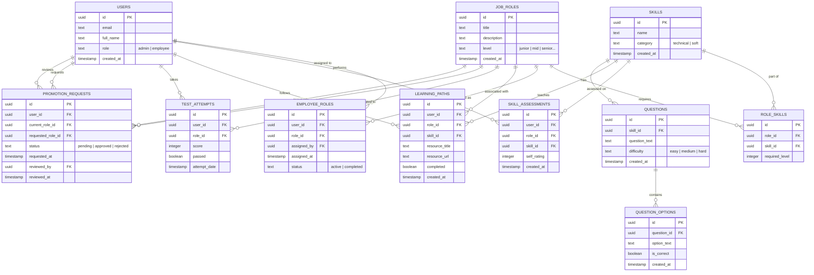

# Entity Relationship (ER) Diagram

## Visual Diagram (Mermaid.js)

## Entities & Attributes

### 1. USERS
*Represents all system users (Employees and Admins).*
- **id** (PK, UUID): Unique identifier.
- **email** (Text): User's email address.
- **full_name** (Text): User's full name.
- **role** (Text): System role ('admin' or 'employee').
- **created_at** (Timestamp): Account creation time.

### 2. JOB_ROLES
*Defines the various roles within the organization (e.g., Junior Developer, Senior Manager).*
- **id** (PK, UUID): Unique identifier.
- **title** (Text): Job title.
- **description** (Text): Description of responsibilities.
- **level** (Text): Seniority level (junior, mid, senior, etc.).
- **created_at** (Timestamp): Record creation time.

### 3. SKILLS
*Library of competencies required for roles.*
- **id** (PK, UUID): Unique identifier.
- **name** (Text): Name of the skill (e.g., React, Leadership).
- **category** (Text): Type of skill (technical or soft).
- **created_at** (Timestamp): Record creation time.

### 4. ROLE_SKILLS (Junction Table)
*Maps skills to job roles with required proficiency levels.*
- **id** (PK, UUID): Unique identifier.
- **role_id** (FK): Reference to Job Role.
- **skill_id** (FK): Reference to Skill.
- **required_level** (Integer): Level required (1-5).

### 5. EMPLOYEE_ROLES
*Tracks which user is assigned to which role.*
- **id** (PK, UUID): Unique identifier.
- **user_id** (FK): The employee.
- **role_id** (FK): The assigned role.
- **assigned_by** (FK): Admin who assigned the role.
- **status** (Text): Status of assignment (active, completed).

### 6. SKILL_ASSESSMENTS
*Self-evaluations performed by employees.*
- **id** (PK, UUID): Unique identifier.
- **user_id** (FK): The employee.
- **role_id** (FK): Contextual role.
- **skill_id** (FK): Skill being assessed.
- **self_rating** (Integer): Rating (1-5).

### 7. LEARNING_PATHS
*Educational resources assigned to bridge skill gaps.*
- **id** (PK, UUID): Unique identifier.
- **user_id** (FK): The employee.
- **role_id** (FK): Related role.
- **skill_id** (FK): Related skill.
- **resource_title** (Text): Title of the learning material.
- **resource_url** (Text): Link to the material.
- **completed** (Boolean): Completion status.

### 8. TEST_ATTEMPTS
*Records of skill verification tests taken by employees.*
- **id** (PK, UUID): Unique identifier.
- **user_id** (FK): The employee.
- **role_id** (FK): Related role.
- **score** (Integer): Test score.
- **passed** (Boolean): Pass/Fail status.
- **attempt_date** (Timestamp): Date of test.

### 9. PROMOTION_REQUESTS
*Formal requests for role advancement.*
- **id** (PK, UUID): Unique identifier.
- **user_id** (FK): The applicant.
- **current_role_id** (FK): Current position.
- **requested_role_id** (FK): Desired position.
- **status** (Text): Request status.
- **reviewed_by** (FK): Admin reviewer.

### 10. QUESTIONS
*Question bank for skill tests.*
- **id** (PK, UUID): Unique identifier.
- **skill_id** (FK): Skill this question tests.
- **question_text** (Text): The question content.
- **difficulty** (Text): Difficulty level.

### 11. QUESTION_OPTIONS
*Multiple-choice options for questions.*
- **id** (PK, UUID): Unique identifier.
- **question_id** (FK): Parent question.
- **option_text** (Text): The option content.
- **is_correct** (Boolean): Correct answer flag.

## Shapes & Placement Guide

If you are drawing this manually or using a tool like Lucidchart/Draw.io:

### Shapes
- **Entities (Tables):** Use **Rectangles**. The top section should contain the Entity Name (e.g., USERS), and the bottom section should list the Attributes (e.g., id, email).
- **Relationships:** Use **Diamonds** if you want to strictly follow Chen's notation, but for modern Crow's Foot notation (recommended for database design), simply use **Lines** connecting the rectangles.
- **Attributes:** If using Chen's notation, use **Ovals** connected to the entity rectangle. For standard ERD, list them inside the entity rectangle.

### Placement & Layout
1.  **Central Hub:** Place **USERS** and **JOB_ROLES** in the center. These are the core entities that most others connect to.
2.  **Left Wing (Configuration):** Place **SKILLS** and **ROLE_SKILLS** to the left of Job Roles. This defines the static requirements of the system.
3.  **Right Wing (Activity):** Place **EMPLOYEE_ROLES**, **SKILL_ASSESSMENTS**, **LEARNING_PATHS**, and **TEST_ATTEMPTS** to the right of Users. These represent the dynamic data generated by user activity.
4.  **Bottom Section (Process):** Place **PROMOTION_REQUESTS** below Users and Job Roles, as it links the two in a workflow.
5.  **Far Left/Bottom (Content):** Place **QUESTIONS** and **QUESTION_OPTIONS** near Skills, as they are the content library supporting the skills.

### Connectors (Crow's Foot Notation)
- **One-to-Many (1:N):** Use a line with a single dash `|` on the "One" side and a crow's foot `<` on the "Many" side.
    - *Example:* One **USER** has many **TEST_ATTEMPTS**.
- **Many-to-Many (M:N):** These are resolved via junction tables (like **ROLE_SKILLS**).
    - *Example:* **JOB_ROLES** `||--o{` **ROLE_SKILLS** `}o--||` **SKILLS**.
